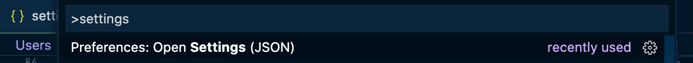

# Why format your code?

I never realized until after I added Prettier just how much more pleasant development can be when the code is formatted for you.

Prior to Prettier, I (and most of the developers I work with) had been writing JavaScript and formatting each file as we saw fit.

While this didn't negatively impact our app or our users, it did cause a lot of inconsistency in our code.

Some developers would declare variables in one long, unbroken line, while others declared each new variable on a new line. Some files would have functions with almost no spaces or new lines, and others would have lots of extra lines in between lines of code. Or, the greatest and most divisive debate of all, the one over which wars have been waged and relationships ruined: some devs would use tabs whereas others would use spaces.

It was chaos. But then, a better way emerged: [Prettier](https://prettier.io/). A code style guide to end the stylistic debates and free up developers to think about more important things than code formatting.

And it got even easier with the VSCode Prettier extension. So easy, I almost don't have to think about it at all; that is the moment when I truly fell in love with code formatting, personally.

**This lesson will take us on a quick tour of what Prettier is and how it works, then we'll set it up so that it will format on save or even when you change focus from one file to another in the project.**

### What is Prettier?

[Prettier](https://prettier.io/docs/en/index.html) is an opinionated code formatter with support for 12+ programming languages and growing, including JavaScript and JSX. It works by removing all of the original styling from a project file and ensuring all the newly outputted code conforms to a consistent style.

Here are a few reasons code formatting with Prettier benefits the whole team.

- It dramatically reduces the amount of time spent nit-picking over personal code style preferences.
- It helps newcomers to the JavaScript language or project get up to speed quicker and debug issues caused by syntax errors faster.
- It makes writing code easier — now there's no need to spend mental energy formatting code.
- It's easy to adopt — the Prettier team worked hard to use the least controversial coding styles and went through many rounds of fixing all the edge cases to make getting started polished and painless.
- It can clean up an existing codebase without being a massive undertaking.

And, luckily, Prettier is simple to add to a JavaScript project and almost as easy to set up with the VSCode extension so that it formats with next to no effort on our part. Let's get to it.

### Set up Prettier in the Hardware Handler app

Now that we've gotten an idea of what Prettier is and why it can benefit everyone on the team, from the newest developers to the experienced seniors, let's set it up in our application.

Although Prettier can be run from the [command line](https://prettier.io/docs/en/cli.html), through [global installation](https://prettier.io/docs/en/install.html), or via the [Prettier API](https://prettier.io/docs/en/api.html), we'll set it up so that any developer can rest assured knowing their Prettier is consistent with the project.

We're going to download it to the project as a dependency, so everyone using it has the same version in addition to having the same config files for it.

The first thing you'll want to do is open up the app in your IDE of choice and, in a new terminal window, `cd` into the `client/` folder. From there, type the following command to save the `"prettier"` dependency to your `package.json`.

```shell
yarn add prettier
```

Now when you check your `package.json`, you should see `"prettier"` in between the `"concurrently"` and `"react"` dependencies.

**package.json**

```jsx
    "concurrently": "^6.0.0",
    "prettier": "^2.6.2",
    "react": "18.0.0",
```

With Prettier installed locally, we can move on to creating the file giving Prettier our preferred code formatting rules to follow.

#### Create a .prettierrc file

At the root of the project, create a new file called `.prettierrc`.


This file can be written in either [JSON](https://www.w3schools.com/js/js_json_syntax.asp) or [YAML syntax](https://docs.ansible.com/ansible/latest/reference_appendices/YAMLSyntax.html).

> **[You can configure Prettier](https://prettier.io/docs/en/configuration.html) in so many ways.**
>
> Prettier is flexible and smart enough that either type of file, even with no file ending like `.json` or `.yaml`, will be correctly interpreted and used within the project.

I prefer JSON syntax (YAML indentation is a little finicky for my tastes), so that's what I'm going to use to define my code formatting rules.

Prettier ships with a [handful of options](https://prettier.io/docs/en/options.html), which I strongly encourage you to explore to see if any really speak to you, but I keep my `.prettierrc` file simple, and I'm still very pleased with the results it gives me.

Here's the Prettier config I end up including in almost every project I work on. Please copy this code, add it to the new `.prettierrc` file, and we'll go through each one of these configuration options.

**.prettierrc**

```json
{
  "endOfLine": "lf",
  "semi": true,
  "singleQuote": true,
  "tabWidth": 2,
  "trailingComma": "es5",
  "printWidth": 80
}
```

#### endOfLine: lf

When people collaborate on a project using different operating systems, there's a good chance the line endings will be a mixture of `\n` (`LF` for Line Feed from macOS and Linux systems) and `\r\n` (`CRLF` for Carriage Return + Line Feed from Windows systems). These differences produce a large `git diff` and thus make the line-by-line history for a file (`git blame`) harder to explore.

Including [`"endOfLine": "lf"`](https://prettier.io/docs/en/options.html#end-of-line) in our `.prettierrc` file ensures that our entire `git` repository will only contain Linux-style line endings in files covered by Prettier.

#### semi: true

This configuration prints semicolons at the end of every statement. Although semicolons aren't _technically_ required by the JavaScript language the way some programming languages (like Java) rely on them, I like them.

Semicolons improve code readability, in my opinion, and I think it helps prevent potential unexpected bugs, so I like to keep [`"semi": true`](https://prettier.io/docs/en/options.html#semicolons) in my `.prettierrc` file, just to be safe.

#### singleQuote: true

Everywhere in the code (omitting JSX) where double quotes are used, this Prettier option will automatically change them to single quotes.

That one is pretty self-explanatory. [`"singleQuote": true`](https://prettier.io/docs/en/options.html#quotes) helps keep strings consistent in the project.

#### tabWidth: 2

Another fairly self-explanatory config option, [`"tabWidth": 2`](https://prettier.io/docs/en/options.html#tab-width) specifies how many spaces per indentation level.

I like my code to be a little more compact, especially when it starts to get fairly deeply nested, but if you like it a little more spread out, feel free to bump this up to `"tabWidth": 4` or more.

#### trailingComma: es5

There are three options for the [`"trailingComma"`](https://prettier.io/docs/en/options.html#trailing-commas) option: `"es5"`, `"all"`, or `"none"`.

The default now is `"es5"`, which adds trailing commas where valid in ES5 (objects, arrays, etc.). The `"all"` option adds trailing commas wherever possible (including trailing commas in function parameter lists and calls) and requires Babel transpilation or a modern browser that supports ES2017. And `"none"` doesn't add any commas ever.

#### printWidth: 80

The `"printWidth"` configuration option specifies the line length the printer will wrap on.

For readability, the Prettier team themselves recommend [`"printWidth": 80`](https://prettier.io/docs/en/options.html#print-width), and I'm happy to acquiesce to their specification.

T> Like I said earlier, there's a number of [Prettier configuration options](https://prettier.io/docs/en/options.html). Have a look through them, and add any that you think will make your development experience more enjoyable.

### Download the Prettier VSCode extension

Right, now we've got a `.prettierrc` file in our application, and this is definitely a good start, but if you're using VSCode as your code editor of choice, we can take it one step further and make code formatting even easier.

To really get the most out of Prettier, it's recommended to run it from your code editor.

> If your editor of choice doesn't support it, you can run a [file watcher](https://prettier.io/docs/en/watching-files.html) to watch for files changed and format them with Prettier.

If you're using VSCode as your IDE, however, there's an extension in the VSCode Extension Marketplace called [Prettier - Code Formatter](https://marketplace.visualstudio.com/items?itemName=esbenp.prettier-vscode).

Find this extension by searching "prettier" after you open the Extensions (the Tetris block-looking icon in the far left of the VSCode editor). The extension you want will be the first one to pop up, and I've included a screenshot below so you can make sure you've got it right (there are a lot of competitors nowadays).


Install this extension, and then we'll finish up our configuration in the VSCode local settings.

### Configure VSCode to auto-format with Prettier on save or change of focus

This is the last step to get Prettier formatting our files on save or change of focus within VSCode.

Open up the VSCode settings by using the keyboard shortcut `CMD + SHIFT + P` (on a Mac) or `CTRL + SHIFT + P` (on Windows) to open up the VSCode command palette, then type "settings" into the search bar, and select the `"Preferences: Open Settings (JSON)"` option when you see the results.



Inside of this file are all our personal workspace settings that take effect in VSCode. In here, add the following lines:

**settings.json**

```json
"editor.formatOnSave": true,
"editor.defaultFormatter": "esbenp.prettier-vscode",
```

The `"editor.formatOnSave": true` is what's going to trigger Prettier every time you save a file or change file focus by clicking out of the program. When you do so, Prettier will auto-format the code you were working on.

To test this is working, open up the `App.js` file in VSCode, scroll down to line 24 where the `componentDidMount` function is called and save the file. If it's working, you should see the state setter go from a single line to broken across multiple lines.

**App.js before Prettier**


Notice how the state is all on a single line in the screenshot above.

**App.js after Prettier**


Once Prettier is added to the project, the code formatting rules take over, and what was once a single line is broken up into multiple lines. That's Prettier at work.

> If Prettier doesn't immediately work, try quitting VSCode and restarting it. The plugin may need a reload to take full effect.

> **Prettier can also be more fine-grained in its code formatting**
>
> If you'd like Prettier to only format certain file types or only auto-format in certain scenarios, you can also specify this in your `settings.json` file like so.
>
> ```json
> "[javascript]": {
>   "editor.formatOnSave": true,
>   "editor.defaultFormatter": "esbenp.prettier-vscode"
> },
> ```
>
> Just specify the language you want to be formatted by Prettier, and choose the settings you want instead of setting it globally for the project.

Excellent. Prettier is now set up in our project, enforcing code formatting standards automatically, so we don't have to. In the next lesson, we'll move on to ESLint and set up those rules to keep our code quality high throughout the project.

---
